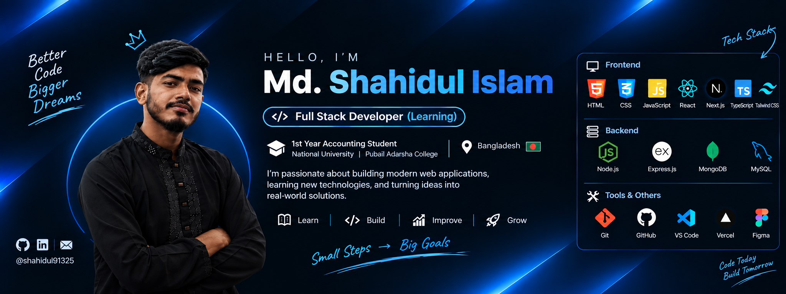

<div align="center">



<br/>

# 👋 Hi, I'm Md. Shahidul Islam

### 💻 Aspiring Full-Stack Developer | 🎓 Accounting Student | 🇧🇩 Bangladesh

<p>
  <a href="https://github.com/shahidul91325">
    
  </a>
  <a href="https://www.linkedin.com/in/shahidul91325/">
    
  </a>
</p>


</div>

---

## 👨‍💻 About Me

I'm **Md. Shahidul Islam**, a student from Bangladesh who is currently building my skills toward becoming a professional **Full-Stack Developer**.

🎓 I'm currently studying **1st Year Accounting at National University, Pubail Adarsha College** while learning software development independently.

💡 I enjoy turning ideas into responsive web applications, exploring new technologies, solving problems, and building projects that help me gain practical experience.

I'm still at the learning stage, but I'm serious about growing into a developer who can contribute to real-world products and professional development teams.

> **Learn → Build → Improve → Grow 🚀**

---

## 🚀 What I Do

- 🌐 Build responsive and user-friendly web interfaces
- ⚛️ Develop applications with React.js
- ▲ Build modern web applications with Next.js
- 🎨 Create responsive UI with Tailwind CSS
- 🔌 Work with APIs and data integration
- 🧠 Practice JavaScript and TypeScript
- 🔧 Use Git & GitHub for version control
- 📚 Learn backend development and databases
- 🛠️ Build projects to improve real-world development skills

---

## 🧰 My Current Tech Stack

### 🎨 Frontend Development

<p>
  
</p>

<p>
  
  
  
  
  
  
  
</p>

### ⚙️ Backend Development

<p>
  
</p>

<p>
  
  
  
</p>

### 🗄️ Database

<p>
  
</p>

<p>
  
  
</p>

### 🛠️ Tools & Workflow

<p>
  
</p>

<p>
  
  
  
  
  
</p>

---

## 📚 Currently Learning

```text
JavaScript
   ↓
React.js
   ↓
Next.js
   ↓
TypeScript
   ↓
Node.js + Express.js
   ↓
MongoDB + MySQL
   ↓
Full-Stack Web Development 🚀
```

### 🔥 My Current Focus

- Strengthening JavaScript fundamentals
- Building React and Next.js projects
- Writing cleaner TypeScript
- Learning backend architecture
- Building REST APIs
- Understanding authentication & authorization
- Working with databases
- Improving Git/GitHub workflow
- Building more real-world projects
- Improving problem-solving skills

---

## 🗺️ My Future Learning Roadmap

These are the areas I plan to explore as I progress toward professional full-stack development:

### Backend & Advanced Web Development
- 🔐 Authentication & Authorization
- 🧩 Advanced API Architecture
- 🗄️ PostgreSQL
- ⚡ Redis
- 📦 Advanced Node.js
- 🧪 Testing

### DevOps & Cloud
- 🐳 Docker
- ☁️ AWS / Cloud fundamentals
- 🔄 CI/CD
- 🐧 Linux & server fundamentals

### Professional Engineering
- 🏗️ System Design fundamentals
- 🧠 Data Structures & Algorithms
- 🧪 Unit & Integration Testing
- 🔒 Web Security
- 📈 Performance Optimization
- 🧹 Clean Code & Design Patterns

---

## 🎯 My Dream & Career Goal

My biggest goal is to become a **professional Full-Stack Developer** who can build reliable, scalable, and meaningful software.

### 🌍 Where I Want to Go

I dream of working with **reputed technology companies**, both in **Bangladesh and internationally**, where I can:

- 💻 Work on real-world software products
- 🤝 Collaborate with experienced developers
- 🧠 Learn from strong engineering teams
- 🚀 Contribute to meaningful projects
- 🌍 Build an international career
- 📈 Continuously improve my technical skills
- 🏗️ Eventually build and lead products of my own

> **Small Steps → Big Goals**

I know becoming a professional developer takes time, consistency, and continuous learning. I'm focused on improving every day and building projects that demonstrate what I can do.

---

## 📂 Featured Project

### 🏋️ FitLog — Workout Management Web App

A responsive workout management application built while practicing modern frontend development, API integration, state management, and responsive UI.

**Tech:** `Next.js` `React` `TypeScript` `Tailwind CSS` `REST API`

🔗 **Repository:**  
https://github.com/shahidul91325/Fit-Log-Web

---

## 📊 GitHub Stats

<div align="center">


<br/>


</div>

---

## 📈 My Developer Journey

<div align="center">

| Stage | Focus |
|---|---|
| 🎓 Student | Building a strong foundation |
| 🌱 Learner | Learning modern web technologies |
| 🛠️ Builder | Creating real-world projects |
| 💻 Developer | Becoming job-ready |
| 🚀 Professional | Contributing to production software |
| 🌍 Global Goal | Building an international career |

</div>

---

## 💼 What I'm Looking For

As I continue growing, I'm interested in opportunities where I can:

- Learn from experienced engineers
- Work on real-world projects
- Contribute to frontend or full-stack applications
- Improve my backend development skills
- Work in collaborative development teams
- Gain professional software engineering experience

**I'm currently focused on learning and building. Opportunities, internships, mentorship, and meaningful collaborations are welcome. 🤝**

---

## 🤝 Let's Connect

<div align="center">

<a href="https://github.com/shahidul91325">
  
</a>

<a href="https://www.linkedin.com/in/shahidul91325/">
  
</a>

<a href="https://www.instagram.com/shahidul91325/">
  
</a>

</div>

---

<div align="center">

### 💻 Learn. Build. Improve. Grow. 🚀

**Code Today • Build Tomorrow • Dream Bigger**

<br/>


</div>
